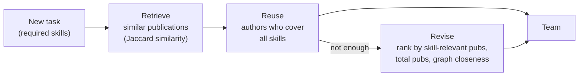

# Skill-Based Team Formation

Forming the right team for a task means finding experts who **together cover every required skill** and who **already work well together**. This project tackles the problem on the **DBLP** computer-science collaboration network. It proposes a **Case-Based Reasoning (CBR)** approach and compares it with existing graph-based algorithms.

## Problem

Given a task (a set of required skills) and a social network of experts, find a team that:

- covers all required skills,
- is small, and
- has a low communication cost (members are close to each other in the collaboration graph).

## Dataset — DBLP

| File | Contents |
|------|----------|
| `dblp-authors.txt` | Author ID → name |
| `dblp-skills.txt` | Skill ID → skill term |
| `dblp-author-skills.txt` | Author → skills |
| `dblp-author-publications.txt` | Author → publications |
| `dblp-pubs-skills.txt` | Publication → skills |
| `dblp-author-pair-collaborations.txt` | Co-authorship edges |
| `dblp.gml` | Collaboration graph (nodes = authors with skills, edges = co-authorships) |

## Approaches

### Proposed: Case-Based Reasoning (CBR)
Past publications are treated as solved "cases": the skills a paper needed and the authors who delivered it.



### Baselines
| Algorithm | Idea |
|-----------|------|
| **Max-Logit** | Randomised local search: swaps one member at a time and accepts changes with a probability based on team diameter |
| **TFS** | Community-based: picks well-connected leaders, then adds the closest experts within *k* hops |
| **RarestFirst** | Starts from experts with the rarest skill, then adds the closest expert for each remaining skill |

## Experiments

For tasks of **4–11 random skills** (10 random tasks per size), the teams from each algorithm are compared on:

| Folder | Metric |
|--------|--------|
| `RCS_26_3c_skill coverge` | Skill coverage |
| `RCS_26_3c_teamsize` | Team size |
| `RCS_26_3c_diameter dist team formed` | Diameter distance (communication cost) |
| `RCS_26_3c_sum dist team formed` | Sum distance |
| `RCS_26_3c_Processingtime` | Processing time |

Each folder is a self-contained copy of the code configured for that metric. Running it plots the metric against the number of required skills.

## Project Structure

```
RCS_26_3c_<experiment>/
├── algo.py              # Max-Logit + experiment runner (entry point)
├── team_cbr.py          # Run the CBR approach for a single task
├── CBRFunctions.py      # CBR pipeline: case base, retrieve, reuse, revise
├── SimilarityMeasure.py # Jaccard similarity & case retrieval
├── ReuseSolution.py     # Reuse step
├── ReviseSolution.py    # Revise step
├── tfs.py               # TFS baseline
├── rarestfirst.py       # RarestFirst baseline
├── Team.py / Teamr.py   # Team model and metrics (diameter, sum distance, diversity…)
├── UtilFunctions.py     # Data loading & skill coverage
├── utilities.py         # Graph helpers
└── data/                # DBLP dataset
```
```

**Tech:** Python · NetworkX · pandas · Matplotlib
